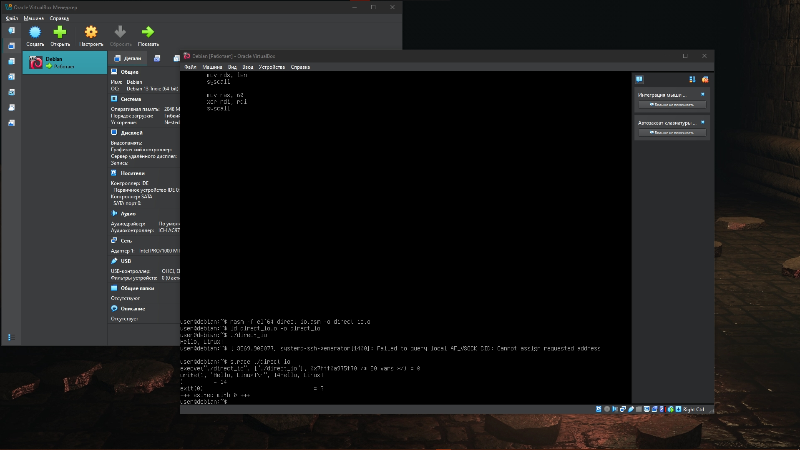
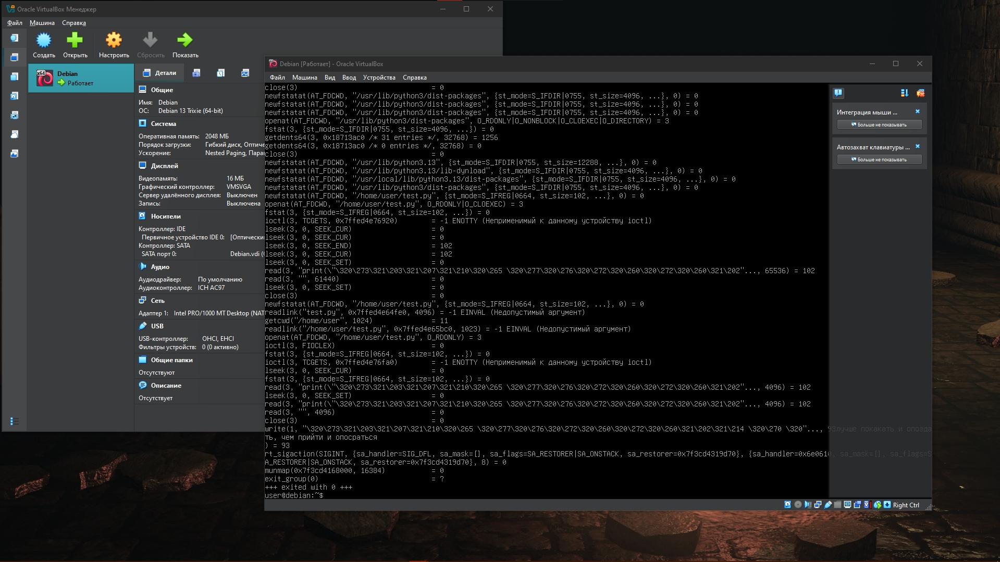

# -# Лабораторная работа №1: Исследование механизмов ввода-вывода и системных вызовов

## 1. Исходный код

### Ассемблер (`direct_io.asm`)
```nasm
section .data
    msg db "Hello, Linux!", 0xA
    len equ $ - msg

section .text
    global _start

_start:
    mov rax, 1
    mov rdi, 1
    mov rsi, msg
    mov rdx, len
    syscall

    mov rax, 60
    xor rdi, rdi
    syscall
```
Python (test.py)
```python
print("лучше покакать и опоздать, чем прийти и опосраться")
```
2. Результаты трассировки


3. Ответы на контрольные вопросы
 * При выполнении инструкции syscall происходит аппаратное прерывание, которое переключает режим работы процессора из пользовательского режима (Ring 3) в режим ядра (Ring 0).
 * Регистры для sys_write: RAX — номер вызова (1), RDI — дескриптор устройства (1), RSI — адрес строки, RDX — длина строки.
 * Программа на ассемблере выполняет только два системных вызова, тогда как интерпретатор Python выполняет множество подготовительных операций по выделению памяти и загрузке библиотек.
